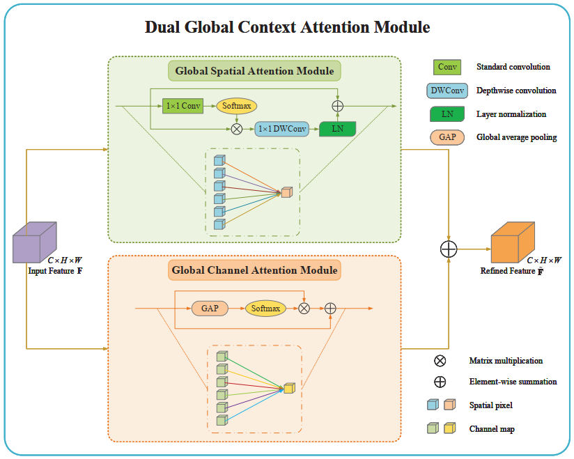
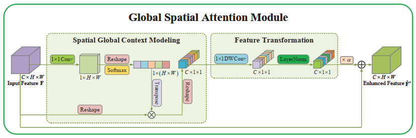
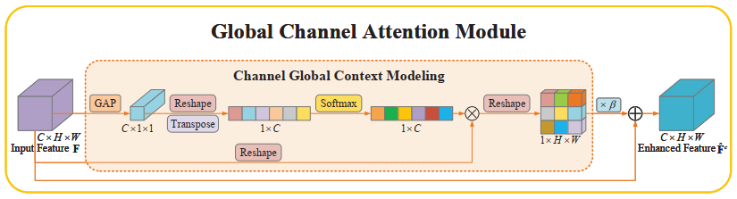
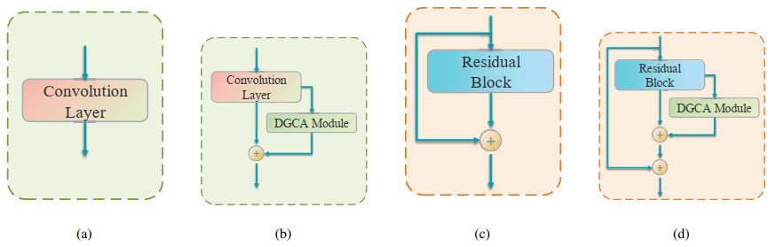
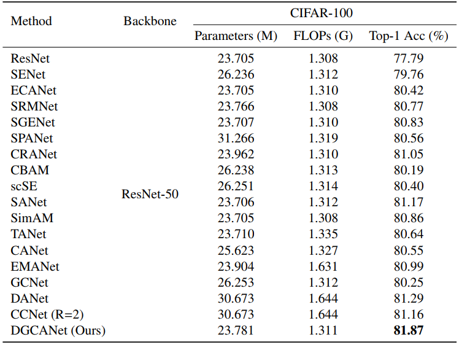
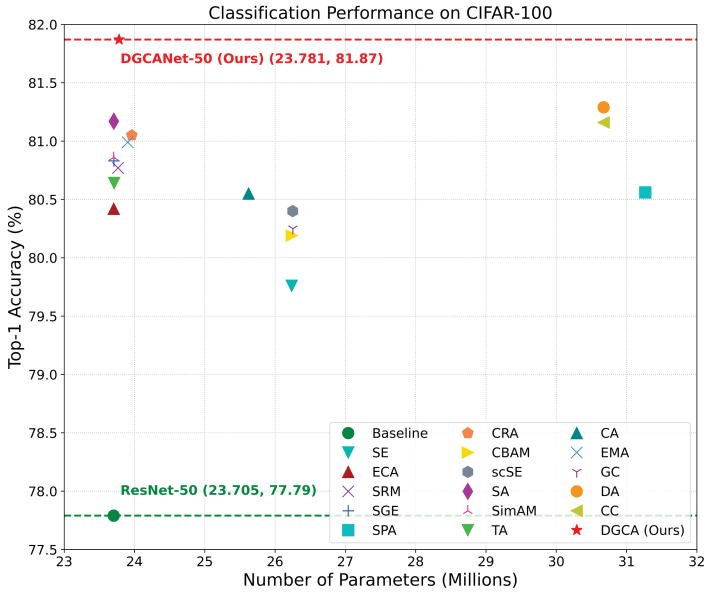
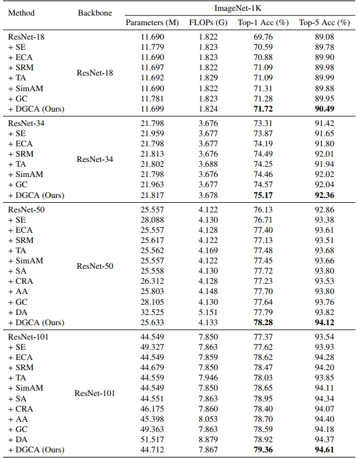
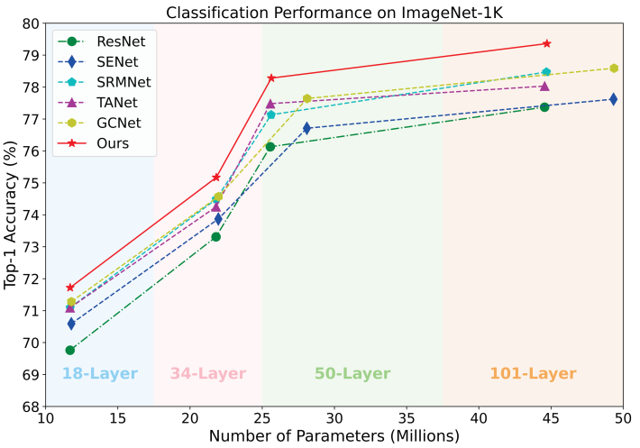

# Dual Global Context Attention Module

***The official PyTorch implementation of "DGCA: A dual global context attention module for image recognition".***

## Method

### Dual global context attention

	

	Figure 1: An overview of the proposed DGCA module.

**Description.** Structurally, the DGCA module consists of two parallel branches, in which the upper branch focuses on capturing global contextual information in the spatial dimension, while the lower branch is responsible for modeling long-range semantic dependencies in the channel dimension.

**DGCA.** Detail of implementations, including modules and the networks, can be found in ``Cifar`` and ``ImageNet`` in this repository. 

### Global spatial attention module

	

	Figure 2: Details of the proposed GSA module.

### Global channel attention module

	

	Figure 3: Detailed illustration of the proposed GCA module.

## Our environments and toolkits

- OS: Ubuntu 18.04.1
- CUDA: 11.6
- Python: 3.9.12
- Toolkit: PyTorch 1.10
- GPU: RTX A6000 (4x)
- [ptflops](https://github.com/sovrasov/flops-counter.pytorch)
- For generating GradCAM++ results, please follow the code on this [repository](https://github.com/jacobgil/pytorch-grad-cam)

## Incorporate the DGCA module into convolutional neural networks

	

	Figure 4: Illustration of the DGCA module integrated into CNNs. Here, (a) CNNs without skip connections; (b) DGCA module integrated into (a); (c) CNNs with skip connections; (d) DGCA module integrated into (c).

## Overview of Results

### Classification results on CIFAR-100

	

	Table 1: Comparison of classification performance of various attention methods on CIFAR-100 based on ResNet-50 architecture. 

	

	Figure 5: Comparison of our method with other state-of-the-art attention methods. 

### Classification results on ImageNet-1K

	

	Table 2: Comparison of efficiency (i.e., Parameters and FLOPs) and effectiveness (i.e., Top-1/Top-5 Acc) of different attention methods on ImageNet-1K classification using ResNet with 18, 34, 50, and 101 layers as backbones, respectively.

	

	Figure 6: Comparison of classification performance on ImageNet-1K between our method and other attention methods.

## Citation
If you find DGCA useful in your research, please consider citing:

## Contact Information

If you have any suggestion or question, you can leave a message here or contact us directly: yang_y9802@163.com. Thanks for your attention!